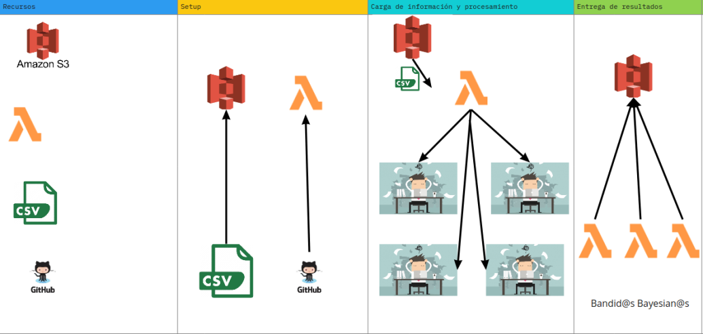

# SERVERLESS APROACH

Una manera de resolver este problema en un prototipo rápido y escalable fue con lambdas.
Se generó un paquete derivado del codigo que se encuentra en ésta carpeta y se empujó a una función lambda.
Dicha función lambda se llama a sí misma cuando termina por lo que de manera sequencial recorre el archivo sin importar el tamaño del archivo de este.

Cada lambda genera un csv con los datos procesados, 1 por cada lambda que se ejecuta. Esto quiere decir que al final se deben combinar los archivos generados para obtener la tabla completa. La ventaja de tenerla en particiones como éstas es que hacer uso de tecnologías como aws batch se vuelve más facil para procesamiento posterior.

A continuacion es presentado un diagrama de como funciona la solución de forma serverless. Cabe notar que el siguiente paso en esta solucion es generar lambdas que funcionen en paralelo para su ejecución más rapida.

